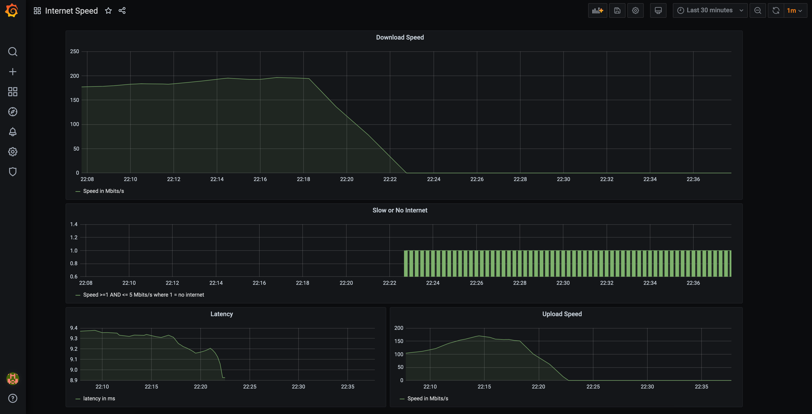

Getting Started
-------------------

Run `docker-compose up` then open http://localhost:3000/d/internetspeed/internet-speed in browser. Login with `admin/admin`. Wait for a few minutes for data to appear. Disconnect your WiFi/Ethernet to see data in "Slow or No Internet" panel.

Here's how it should look like:

